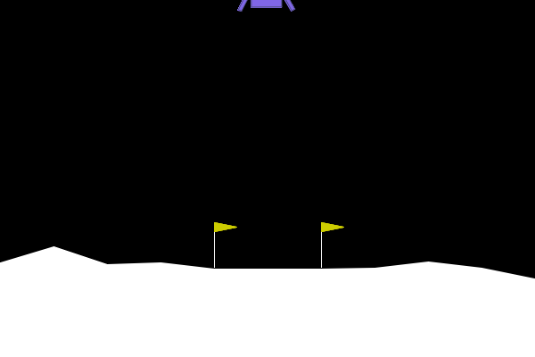

<!-- Display the GIF centered -->
<p align="center">
  
</p>

# Proximal Policy Optimization (PPO) for Discrete Control Systems

## Overview
This repository contains a clean, "from-scratch" implementation of the **Proximal Policy Optimization (PPO)** algorithm using **PyTorch**. 

While developed using the `LunarLander-v3` environment as a benchmark, the underlying **Actor-Critic** architecture is designed to be adaptable for industrial control tasks, such as robotic actuation or energy management system optimization.

## Architecture
The agent utilizes a dual-network Actor-Critic structure:
*   **Actor Network:** Predicts the probability distribution of actions (Discrete) based on state inputs.
*   **Critic Network:** Estimates the Value function V(s) to compute advantages and guide the gradient updates.
*   **Optimization:** Uses the PPO "Clipped Surrogate Objective" to ensure stable policy updates, preventing catastrophic forgetting during training.

## Key Implementation Details
Unlike high-level libraries (like Stable Baselines) which hide the logic, this implementation explicitly handles:
*   **Advantage Estimation:** Manual calculation of discounted returns and advantage normalization.
*   **Policy Clipping:** Custom implementation of the PPO ratio clipping ($\epsilon = 0.2$) to constrain policy shifts.
*   **TensorBoard Integration:** Real-time logging of Actor Loss, Critic Loss, and Average Reward to visualize convergence.

## Tech Stack
*   **Deep Learning:** PyTorch (`torch.nn`, `torch.optim`)
*   **Environment:** Gymnasium (formerly OpenAI Gym)
*   **Visualization:** TensorBoard
*   **Math:** NumPy

## Usage
To train the agent and view real-time metrics:

```bash
# Run the training loop
python PPO_mod.py

# Launch TensorBoard to view loss curves
tensorboard --logdir=runs/
